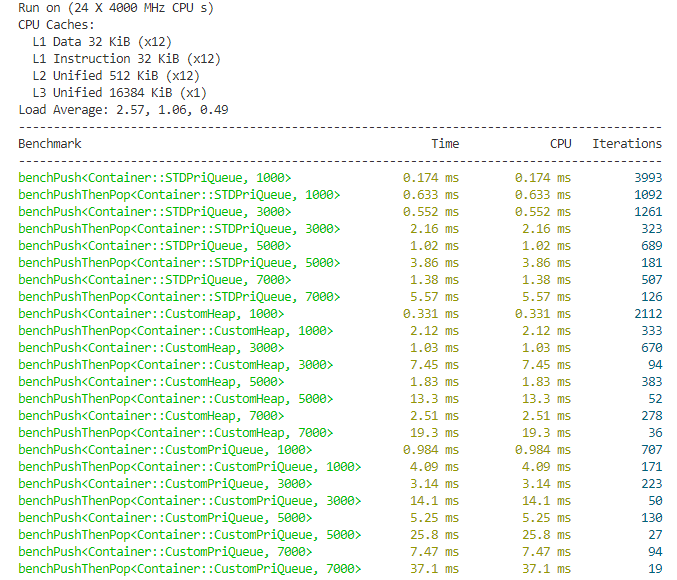
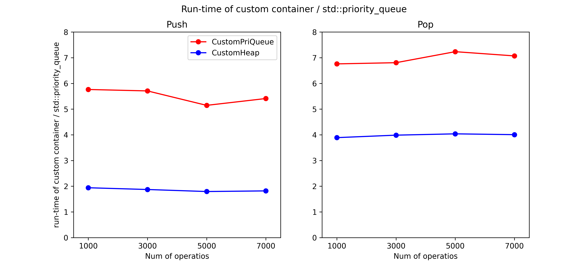
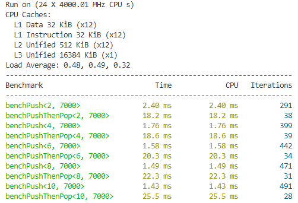
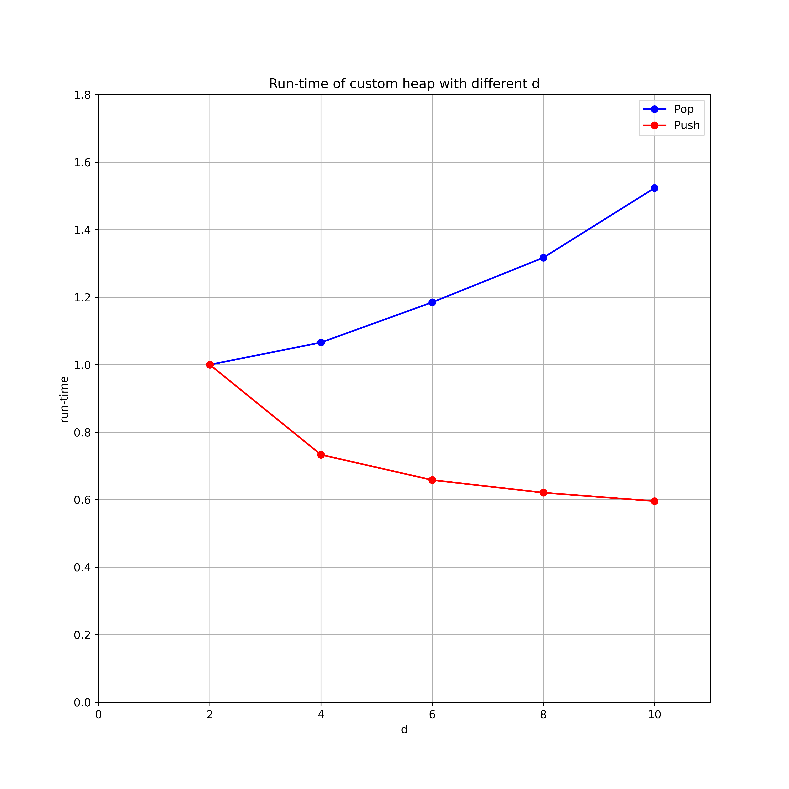

<center> <font size=8> D-ary Heap </font></center>

使用C++实现的 `D-ary heap` 和基于此开发的 `updatable priority queue` ，参考了[updatable priority queue](https://github.com/Ten0/updatable_priority_queue)。

# 使用

直接引用对应的头文件即可使用。

### D-ary heap

```c++
#include "src/d_ary_heap.hpp"

// 构建空的存储int型数据的最大堆，其中每个父节点最多可以有3个子节点。
auto max_heap = createEmptyMaxDHeap<int>(3);
max_heap.push(0);
max_heap.push(1);
// size == 2。
size_t size = max_heap.size();
// top_element == 1。
auto top_element = max_heap.top();
max_heap.pop();
max_heap.pop();
// is_empty == true。
bool is_empty = max_heap.empty();
```

### Updatable priority queue

```c++
#include "src/priority_queue.hpp"

// 构建空的存储string型数据的最小优先队列，这些数据的优先级用double表示，
// 队列中每个父节点最多可以有2个子节点。
auto min_pri_queue = createEmptyMinPriQueue<std::string, double>();
// 将元素和它的优先级插入队列中。
min_pri_queue.push("A-star", 3.0);
min_pri_queue.push("Dijkstra", 2.0);
min_pri_queue.push("Bellman-Ford", 1.0);
// top_element == "Bellman-Ford"。
auto top_element = min_pri_queue.top();
// contains_RRT == false。
bool contains_RRT = min_pri_queue.contains("RRT");
// pri_Dijkstra == 2.0。
auto& pri_Dijkstra = min_pri_queue.getPriority("Dijkstra");
// pri_Dijkstra == 1.5。
min_pri_queue.updatePriority("Dijkstra", 1.5);
```

# 单元测试

存储于 `test` 文件夹中的测试用例里有更多关于这两个数据结构的使用示例，在执行这些测试用例之前需要先安装[GoogleTest](https://github.com/google/googletest)，再编译并执行 `test_d_ary_heap` 即可。

# benchmark

benchmark用例存储于 `bench` 文件夹中，在第一个用例中比较了自定义数据结构和 `std::priority_queue` 执行 `push` 和 `pop` 两种操作所需的时间（d = 2，GCC 9.4， Release模式），结果如下：



| Run-time (ms) | Push x 1000 | Pop x 1000 | Push x 3000 | Pop x 3000 | Push x 5000 | Pop x 5000 | Push x 7000 | Pop x 7000 |
| ----------- | ----------- | ----------- | ----------- | ----------- | ----------- | ----------- | ----------- | ----------- |
| STDPriQueue | 0.17 |0.46 | 0.55 | 1.61 | 1.02 | 2.84 | 1.38 | 4.19 |
| CustomHeap | 0.33 | 1.79 | 1.03 | 6.42 | 1.83 | 11.47 | 2.51 | 16.79 |
| CustomPriQueue | 0.98 | 3.11 | 3.14 | 10.96 | 5.25 | 20.55 | 7.47 | 29.63 |

接下来我们以 `std::priority_queue` 执行一些操作所需的时间为基准，对这两种自定义数据结构的运行效率进行评估，它们执行 `push` 和 `pop` 操作的效率如下图所示：



进一步地，在第二个用例中比较了自定义的`heap`数据结构在`d`不同的情况下执行7000次`push`和`pop`操作所需的时间，结果如下：



| Run-time (ms) | Push x 7000 | Pop x 7000 |
| ----------- | ----------- | ----------- |
| d = 2 | 2.4 | 15.8 |
| d = 4 | 1.76 | 16.84 |
| d = 6 | 1.58 | 18.72 |
| d = 8 | 1.49 | 20.81 |
| d = 10 | 1.43 | 24.07 |

现在我们以`d = 2`时执行这些操作所需的时间为基准，对比当`d`为不同值时自定义`heap`数据结构的效率：



我们可以发现当`d`增大的时候执行同样的`push`操作所需的时间减少，但是执行`pop`操作所需的时间增加。

如果想运行这些benchmark用例需要先安装[Benchmark](https://github.com/google/benchmark)，再编译并执行 `bench_compare_different_container`和`bench_compare_different_d`。
