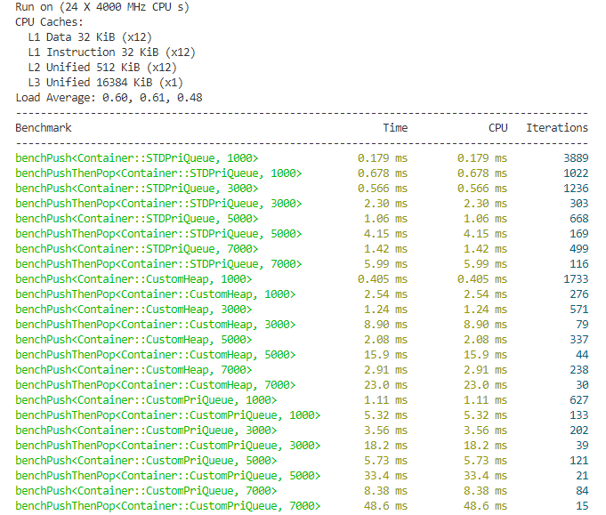

<center> <font size=8> D-ary Heap </font></center>

使用C++实现的 `D-ary heap` 和基于此开发的 `updatable priority queue` ，参考了[updatable priority queue](https://github.com/Ten0/updatable_priority_queue)。

# 使用

直接引用对应的头文件即可使用。

### D-ary heap

```c++
#include "src/d_ary_heap.hpp"

// 构建空的存储int型数据的最大堆，其中每个父节点最多可以有3个子节点。
auto max_heap = createEmptyMaxDHeap<int>(3);
max_heap.push(0);
max_heap.push(1);
// size == 2。
size_t size = max_heap.size();
// top_element == 1。
auto top_element = max_heap.top();
max_heap.pop();
max_heap.pop();
// is_empty == true。
bool is_empty = max_heap.empty();
```

### Updatable priority queue

```c++
#include "src/priority_queue.hpp"

// 构建空的存储string型数据的最小优先队列，这些数据的优先级用double表示，
// 队列中每个父节点最多可以有2个子节点。
auto min_pri_queue = createEmptyMinPriQueue<std::string, double>();
// 将元素和它的优先级插入队列中。
min_pri_queue.push("A-star", 3.0);
min_pri_queue.push("Dijkstra", 2.0);
min_pri_queue.push("Bellman-Ford", 1.0);
// top_element == "Bellman-Ford"。
auto top_element = min_pri_queue.top();
// contains_RRT == false。
bool contains_RRT = min_pri_queue.contains("RRT");
// pri_Dijkstra == 2.0。
auto& pri_Dijkstra = min_pri_queue.getPriority("Dijkstra");
// pri_Dijkstra == 1.5。
min_pri_queue.updatePriority("Dijkstra", 1.5);
```

# 单元测试

存储于 `test` 文件夹中的测试用例里有更多关于这两个数据结构的使用示例，在执行这些测试用例之前需要先安装[GoogleTest](https://github.com/google/googletest)，再编译并执行 `test_d_ary_heap` 即可。

# benchmark

benchmark用例存储于 `bench` 文件夹中，在用例中比较了自定义数据结构和 `std::priority_queue` 执行 `push` 和 `pop` 两种操作所需的时间，测试结果如下：



如果想运行这些benchmark用例需要先安装[Benchmark](https://github.com/google/benchmark)，再编译并执行 `bench_d_ary_heap` 。
